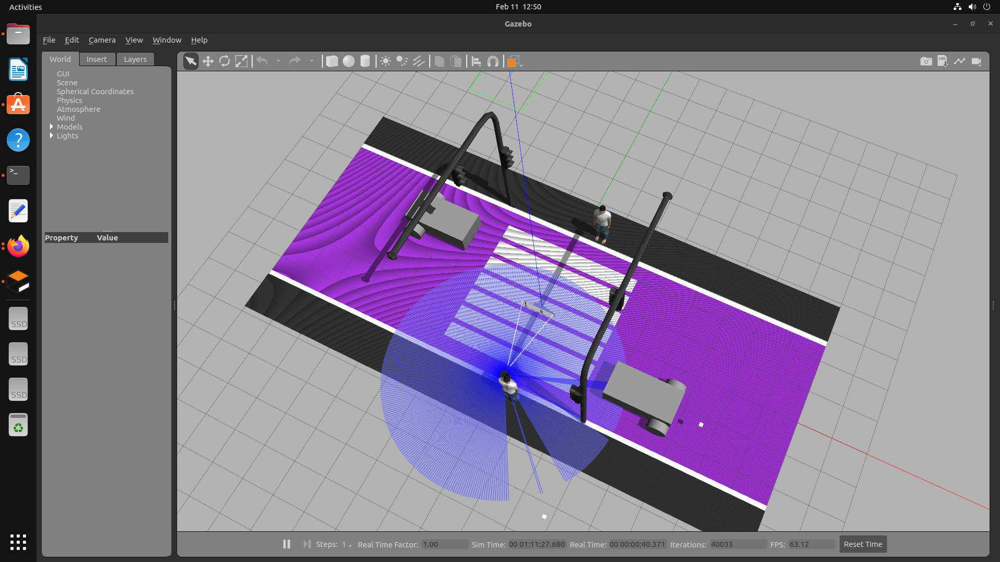
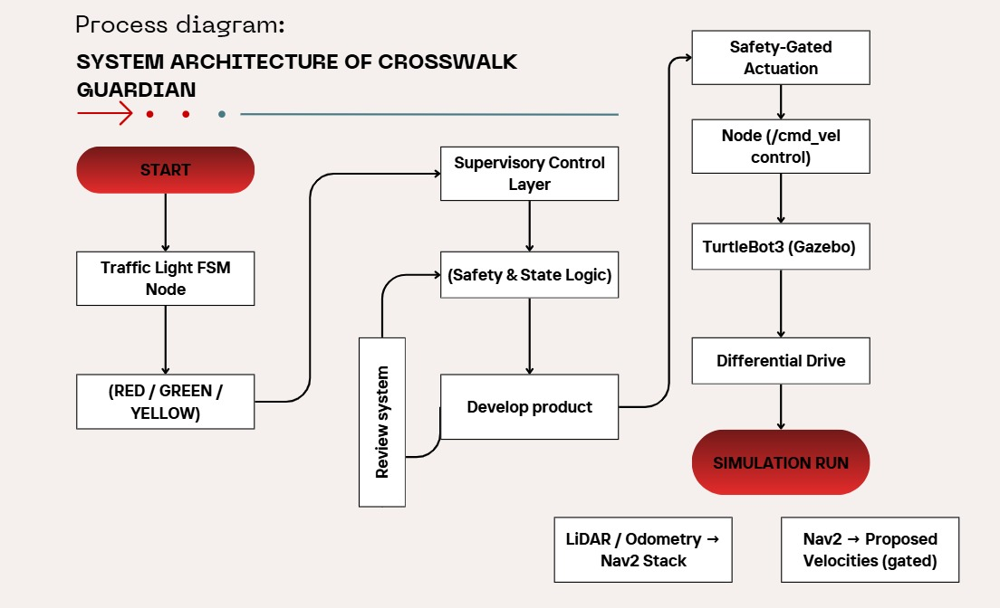
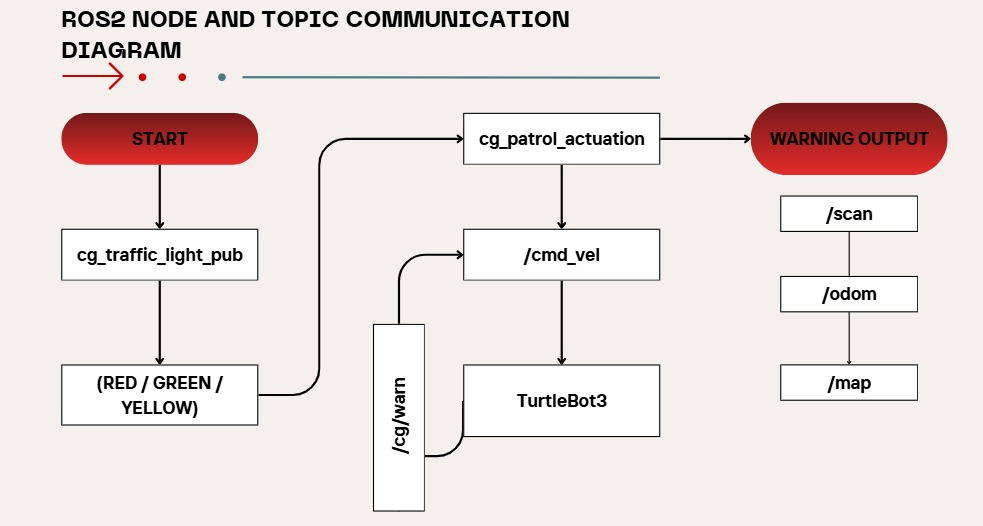
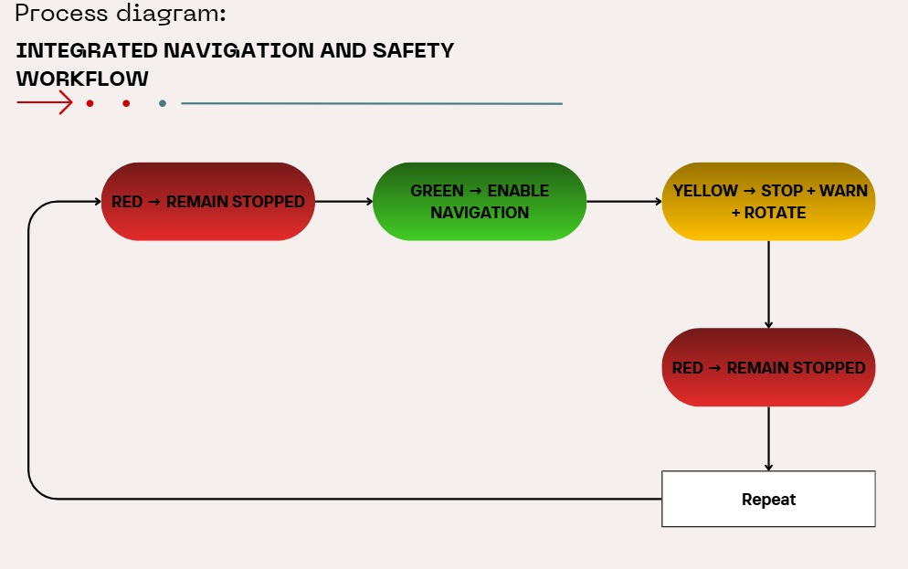

<p align="center">
  
</p>

# Crosswalk Guardian (ROS 2 + Gazebo)


ROS 2 Humble + Gazebo simulation of an intelligent crosswalk safety system using TurtleBot3.  
Robot motion is governed by a supervisory traffic-light control architecture to ensure deterministic and safe operation.
---

# 🎥 Demo Video

Click the image below to watch the full system demonstration:

[](https://youtu.be/pUyI2uL8t7E)

The demo showcases:

- Deterministic startup sequencing
- GREEN phase curb-to-curb patrol
- YELLOW warning behavior with continuous alert
- 180° rotation strictly at curb location
- Immediate RED phase motion stop
- Supervisory topic-based safety gating

---

## Simulation Preview


---

## 1. Project Overview

Crosswalk Guardian is a supervisory-controlled robotic patrol system designed to simulate crosswalk safety enforcement. The system integrates:

- ROS 2 node-based architecture
- Finite State Machine (FSM) behavior control
- Traffic-light supervisory control (GREEN / YELLOW / RED)
- Deterministic startup sequencing for safety
- LiDAR-based sensing visualization (Gazebo)

The robot patrols curb-to-curb and reacts to traffic-light states in a controlled and repeatable manner.

---

## 2. System Architecture

The system consists of two primary ROS 2 nodes:

### 2.1 Traffic Light Publisher Node (`cg_traffic_light_pub.py`)
**Role:** Provides supervisory control signal.  
**Publishes:**
- `/cg/traffic_light` (std_msgs/String): `GREEN`, `YELLOW`, `RED`

**Logic:**
- Cyclic timing: GREEN → YELLOW → RED → GREEN

---

### 2.2 Patrol Actuation Node (`cg_patrol_actuation.py`)
**Role:** Executes motion + safety behavior based on supervisory signal.  
**Subscribes:**
- `/cg/traffic_light` (std_msgs/String)

**Publishes:**
- `/cmd_vel` (geometry_msgs/Twist): robot motion commands  
- `/cg/warn` (std_msgs/String): warning message during YELLOW

**Key behavior:**
- GREEN: move curb-to-curb (waypoint patrol)
- RED: stop immediately (`/cmd_vel = 0`)
- YELLOW: continuous warning sound + warning message + 180° turn **only at curb**

---

## 3. Finite State Machine (FSM)

The robot behavior is governed by an FSM:

| State | Trigger | Robot Behavior |
|------|---------|----------------|
| RED | `/cg/traffic_light = RED` | Stop immediately (cmd_vel = 0) |
| GREEN | `/cg/traffic_light = GREEN` | Patrol curb-to-curb |
| YELLOW | `/cg/traffic_light = YELLOW` | Publish warning + continuous sound + turn at curb only |

### Safety rules enforced
- Robot never moves without GREEN
- Robot never rotates mid-crosswalk
- Robot immediately halts on RED
- Turning occurs only after reaching curb (goal tolerance condition)

This ensures deterministic and safe behavior suitable for real deployment principles.

---

## 4. Safety Design Considerations

The actuation node is started before the traffic-light publisher to guarantee a safe idle startup state.  
Motion is gated strictly by supervisory signals, preventing unintended motion during system initialization.

Rotation logic is constrained to curb locations to avoid unsafe turning behavior within the crosswalk region.

---

## 5. Control Parameters (Current)

| Parameter | Value |
|----------|-------|
| Max Linear Velocity | 0.12 m/s |
| Max Angular Velocity | 0.8 rad/s |
| GREEN Duration | 45 s |
| YELLOW Duration | 10 s |
| RED Duration | 22 s |

---

## 6. Launch Instructions (Recommended Order)

### Terminal 1 — Launch Gazebo World (Server)
```bash
source /opt/ros/humble/setup.bash
killall -9 gzserver gzclient || true
pkill -f cg_ || true

gzserver --verbose \
  -s libgazebo_ros_init.so \
  -s libgazebo_ros_factory.so \
  worlds/crosswalk_final.world

---

# System Architecture



This diagram illustrates the supervisory control structure between ROS 2 nodes,
topics, and Gazebo simulation environment.

---

# ROS 2 Node and Topic Communication



The architecture follows a publisher-subscriber model:
- Traffic light node publishes state
- Patrol actuation node subscribes
- Velocity commands sent to `/cmd_vel`
- Gazebo simulates robot motion

---

# Integrated Navigation & Safety Workflow



The workflow integrates:
- Supervisory signal validation
- State-based control logic
- Safety gating
- Deterministic motion execution
